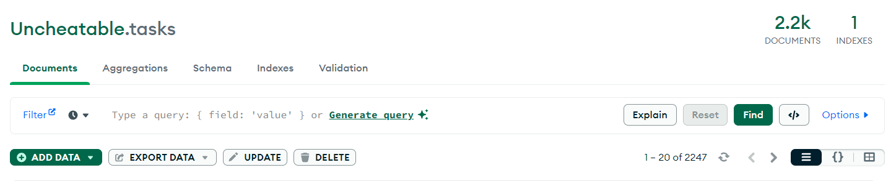
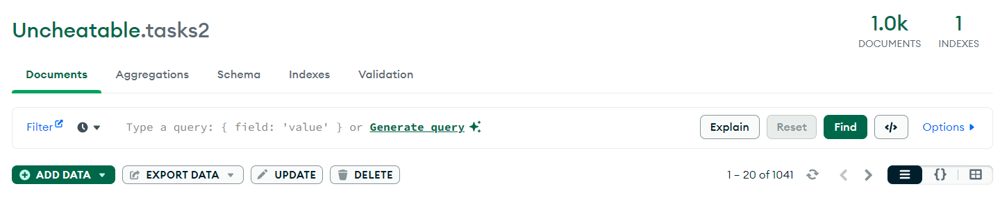

# Uncheatable Exam Data Scraper

The Uncheatable Exam Data Scraper is a project composed of a Chrome extension and a server, working together to extract exam question data from a specific webpage. With a collection of 3288 exam questions, this tool is essential for another project named "Uncheatable". Please note that for legal reasons, original website links are not included.

## Web Extension

The web extension simplifies the process of gathering exam data from the webpage. It automatically submits the exam form, navigates to the answer page, and extracts questions, correct answers, and associated images. This data is then sent securely to the server. Additionally, the extension ensures continuous extraction until a predetermined number of tasks is reached.

## Server

The server receives the scraped exam data from the web extension, processes it, saves the images locally and stores the questions with image paths in a MongoDB database. It handles incoming requests, validates and manipulates the data, ensuring its integrity. By securely managing the data, the server enables seamless integration with the "Uncheatable" project.

